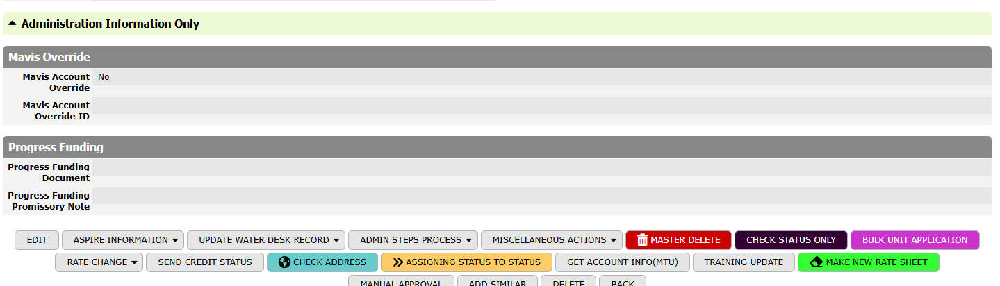
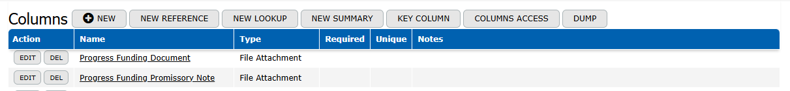
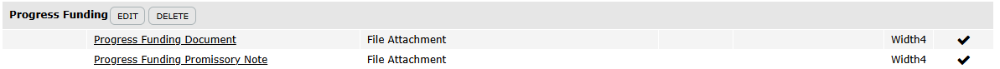
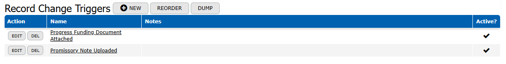
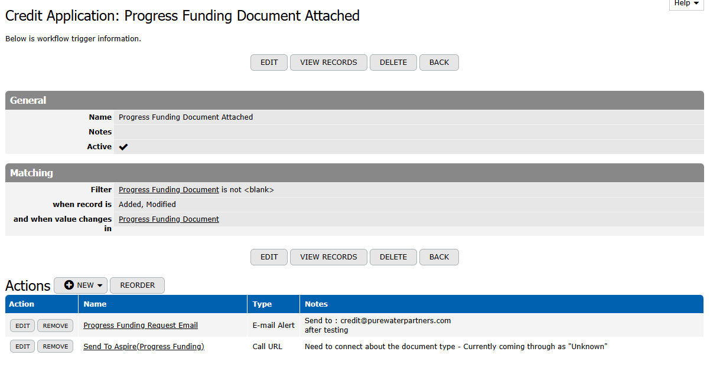
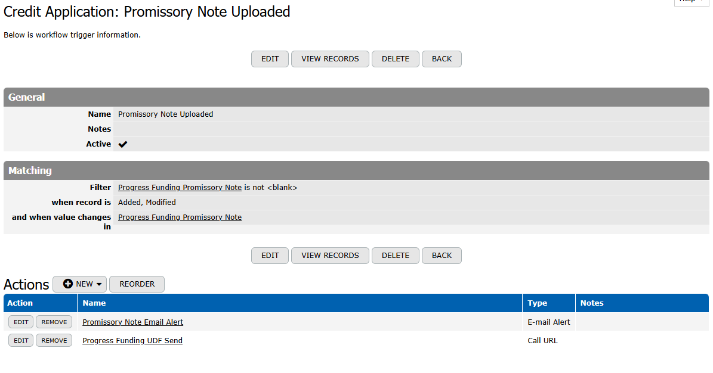
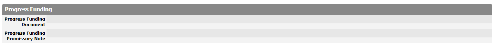

# Progress Funding Feature – TeamDesk Implementation Specification

## Overview

The Progress Funding feature enables users to upload funding-related documents within a Credit Application and automatically triggers backend processing when a signed Promissory Note is provided.

This feature represents a key business step indicating that an application is ready for funding-related processing.

---

## Conceptual Model

The workflow is event-driven. The upload of the **Progress Funding Promissory Note** acts as the trigger event.

When the field changes from empty to populated and the record is saved:
- An email notification is sent
- A request is made to an external API

There is no explicit “submit” button. The file upload and save action represent submission.

---

## Frontend Usage

### Overview

The Progress Funding section appears directly within the Credit Application form and is used by dealers to upload required documents.

---

### Location in UI

- Located in the Credit Application form
- Section name:
  ```
  Progress Funding
  ```

- Fields:
  - Progress Funding Document
  - Progress Funding Promissory Note



---

### User Workflow

1. Open a Credit Application
2. Scroll to the Progress Funding section
3. Upload documents:
   - Optional: Progress Funding Document
   - Required: Progress Funding Promissory Note
4. Click Save

---

### System Response (User Perspective)

After saving:
- Files display as clickable links
- No confirmation message is shown
- Backend actions are triggered automatically


---

### Expected Behavior

- Files persist after save
- Files remain visible on reload
- Additional files can be added or replaced

---

### Common User Errors

- Uploading incorrect file
- Re-uploading or replacing files unnecessarily
- Saving multiple times after upload

These actions may result in duplicate backend triggers.

---

## Data Model

### Progress Funding Document
- File Attachment
- Optional supporting documents

### Progress Funding Promissory Note
- File Attachment
- Required trigger document



---

## TeamDesk Configuration

### 1. Create Columns

Setup → Tables → Credit Applications → Columns

Create:
- Progress Funding Document (File Attachment)
- Progress Funding Promissory Note (File Attachment)

---

### 2. Form Layout

Setup → Tables → Credit Applications → Forms → Customize Form Layout

- Create section: Progress Funding
- Add both fields to the section



---

### 3. Change Handler

Setup → Tables → Credit Applications → Change Handlers

Condition:
```
Progress Funding Promissory Note IS NOT EMPTY
```

Actions:
- Send Email
- API Call






---

## Backend Behavior

- Trigger fires on save when field is populated
- Multiple saves may retrigger actions
- File replacement may cause duplicate executions

---

## API Integration

- Method: POST
- Endpoint: Test (test2) initially
- Payload: Credit Application data

---

## Testing

### Steps

1. Open test record
2. Upload Promissory Note
3. Save

### Verify

- File appears
- Email is received
- API call succeeds



---

## Deployment

1. Test in sandbox
2. Validate with stakeholders
3. Move to production endpoint

---

## Risks

- Duplicate triggers
- No validation on file type
- No retry logic

---

## Future Improvements

- PDF validation
- Submission status field
- Duplicate prevention
- Error handling
