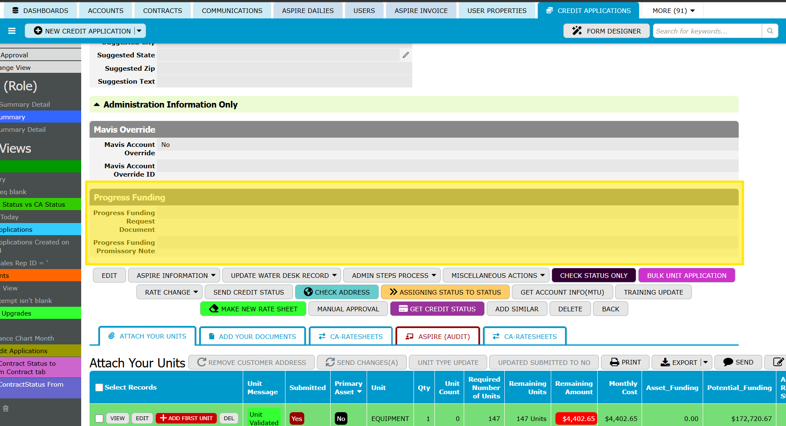
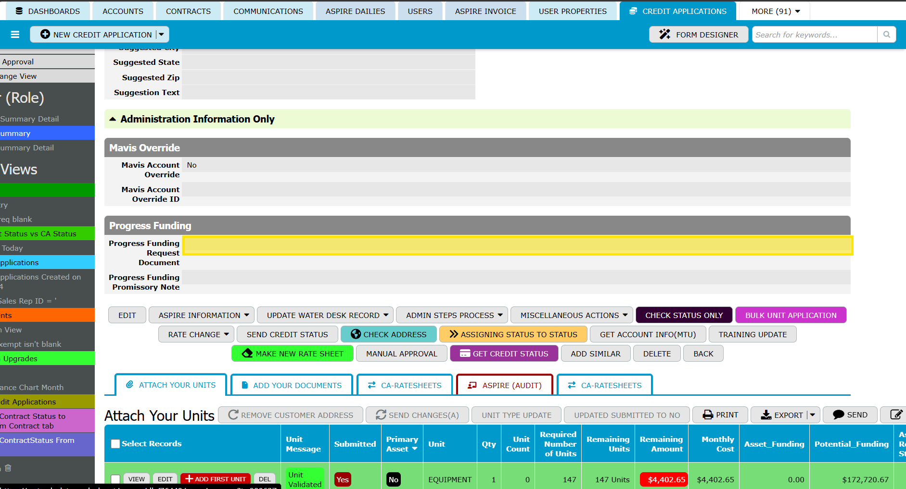
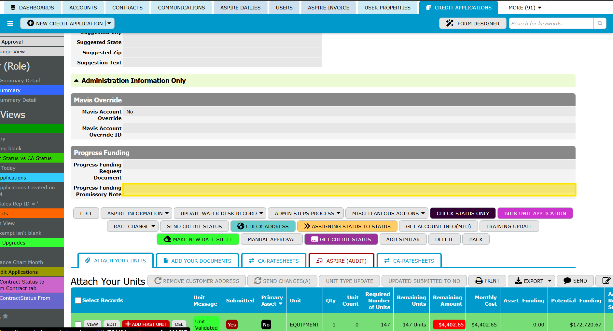

# Progress Funding – Frontend User Guide

## Overview
The **Progress Funding** section on a Credit Application lets approved users upload two documents:

  1. **Progress Funding Request Document**
  2. **Progress Funding Promissory Note**

After each upload, TeamDesk automatically notifies the internal team and sends the related update to Aspire.

## Who can use this section
The **Progress Funding** section is available only to approved users.

If you do not see this section on your Credit Application, contact your administrator or internal support team.

> [!NOTE]
> If the **Progress Funding** section is not visible, your role or user access may not allow it.

---

## Step 1 — Upload the Progress Funding Request Document
  1. Open the correct **Credit Application** record.
  2. Scroll to the **Progress Funding** section.
     
  4. Upload your file in **Progress Funding Request Document**.
     
  5. Save the record if prompted.

### What happens next
  - The internal credit team is notified automatically.
  - The uploaded document is sent to Aspire automatically.

> [!TIP]
> Before saving, confirm that you are working in the correct Credit Application record.

---

## Step 2 — Upload the Progress Funding Promissory Note
  1. Open the same **Credit Application** record.
  2. In the **Progress Funding** section, upload your file in **Progress Funding Promissory Note**.
    
  3. Save the record if prompted.

### What happens next
  - The internal funding/credit team is notified automatically.
  - Aspire is updated automatically.
    
---

## Important
If you replace either uploaded file later, the system may treat it as a new submission.

That means:
- notifications may be sent again
- the Aspire update may run again

Only replace a file if you intend to resubmit it.

> [!WARNING]
> Re-uploading or replacing a file may submit the process again.

---

## Tips
- Make sure you are uploading the file to the correct Credit Application.
- Double-check the file before saving.
- If the **Progress Funding** section is missing, or if you are unsure whether a file was submitted correctly, contact your administrator or support team.

